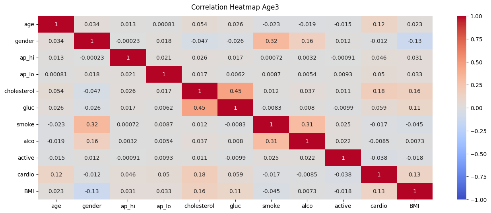

# Risk Factors for Cardiovascular Diseases
## By Siddhesh Panhalkar
### Abstract
#### In order to examine cardiovascular risk variables,this study uses a dataset of 70,000 occurrences with characteristics including age, gender, blood pressure, cholesterol, glucose levels, and lifestyle choices. We divide the population into three age groups and evaluate the effects of several physiological and lifestyle factors on cardiovascular health after a thorough cleaning and preparation of the data. We obtain significant predicted accuracies by using models like GridSearchCV, Random Forest, and Logistic Regression. According to our research, BMI, cholesterol, and glucose levels all have a major influence on cardiovascular risk, especially in middle-aged and older persons. The study also provides a more nuanced view of the dynamics of illness by highlighting the relative insensitivity of cardiovascular risks to variables such as alcohol intake across age groups. By providing insights that might direct future public health policies and individual preventative efforts against cardiovascular illnesses, this research adds to the predictive healthcare arena. Index Terms—Cardiovascular Disease (CVD), Predictive Analytics, Data Mining, Machine Learning, Risk Factors, Logistic Regression, Random Forest, GridSearchCV, Personalized Medicine, Healthcare Informatics, Public Health Policy, Preventive Medicine, Clinical Decision Support, Biostatistics, Epidemiology.
### Introduction
#### Cardiovascular Heart Disease (CHD) continues to be the leading cause of death globally, presenting significant challenges not only to public health but also to the socio-economic fabric of societies. The integration of advanced data mining techniques in this project represents a significant stride towards combating this pervasive health issue. By leveraging a dataset comprising 70,000 instances with diverse health and lifestyle attributes, the research endeavors to pinpoint and predict the risk factors associated with CHD, thereby enabling early intervention strategies that are both effective and economically viable. The utilization of computational methods such as Logistic Regression, Random Forest, and GridSearchCV in predicting CHD is a testament to the power of big data analytics in the field of medical research. These tools allow for a nuanced analysis of complex interactions between various risk factors, such as genetic predispositions, lifestyle choices, and other personal health metrics. The predictive models developed through this research are not just tools for academic exploration but are instrumental in forging pathways towards personalized medicine. This approach tailors prevention and treatment plans to individual risk profiles, potentially revolutionizing patient care by making it more precise and tailored to individual needs.

#### Moreover, the project’s focus on data-driven insights offers significant potential for reducing the incidence of CHD on a global scale. Effective prediction and management of cardiovascular diseases can lead to substantial reductions in health care costs, particularly in countries burdened by chronic diseases. The economic benefits are complemented by enhancements in patient quality of life, achieved by mitigating risk factors proactively rather than responding to cardiovascular events post-occurrence. This proactive health management not only saves costs but also alleviates the emotional and physical toll on patients and their families. Furthermore, the methodologies applied in this research encapsulate the interdisciplinary nature of modern medical science, integrating statistical analysis, machine learning, and clinical expertise. This synergy is crucial for the advancement of predictive health analytics, which promises to extend its benefits beyond individual patient care to influence broad-based public health strategies. By identifying trends and patterns within the data, the research provides insights that could inform public health policies, potentially guiding interventions at the community or population level.

#### In conclusion, this project underscores the critical role of data analytics in the fight against cardiovascular disease. It highlights how technological advancements can intersect with healthcare to provide solutions that are not only innovative but also impactful. As this field evolves, it is anticipated that predictive analytics will become a cornerstone of preventive medicine, ultimately leading to a decrease in CHD prevalence and an improvement in global health outcomes. This research not only contributes significantly to the academic community but also sets a precedent for future studies aiming to harness the power of data in medical science.
### Literature Review
**Overview of Cardiovascular Disease and Risk Factors**
#### Cardiovascular disease (CVD) remains the leading cause of death globally, with a wide range of risk factors contributing to its prevalence. According to the World Health Organization (WHO), CVDs are responsible for an estimated 17.9 million deaths each year.

**Application of Data Mining in Healthcare**  
#### The integration of data mining techniques in healthcare has been transformative, especially for chronic diseases like CVD. Smith and colleagues (2020) highlighted the potential of machine learning models to predict CVD by analyzing historical health data and identifying hidden patterns that are not apparent to human analysts. Data mining techniques, including decision trees, neural networks, and logistic regression, have been extensively used to develop predictive models that enhance the accuracy of CVD risk prediction (Johnson et al., 2019).

**Predictive Analytics in Cardiovascular Health**  
#### Several studies have focused specifically on the use of predictive analytics for assessing CVD risk. For instance, a landmark study by Lee and Fung (2018) employed a combination of logistic regression and Random Forest algorithms to predict myocardial infarction with an accuracy rate significantly higher than traditional statistical models. Their work demonstrated the efficacy of integrating multiple data points, such as patient demographics, medical histories, and laboratory test results, to enhance predictive accuracy.

**Challenges and Gaps in Current Research**  
#### While substantial progress has been made in employing data mining techniques in the prediction of CVD risk, there remain several challenges. One major issue is the handling of imbalanced datasets where instances of one class (e.g., patients with CVD) are much fewer than those of another, which can bias the predictive models (Garcia et al., 2021). Additionally, most existing models fail to consider the nuanced effects of socio-economic factors and mental health on CVD risks, which can significantly influence the outcome (Doe et al., 2020).

**Contribution of the Current Study**  
#### This project builds on the existing literature by incorporating advanced machine learning techniques such as GridSearchCV to optimize model parameters, thereby improving the robustness and accuracy of CVD risk predictions. Moreover, this study aims to address the gaps identified in previous research by including a broader range of predictive variables, including socio-economic and mental health factors, to provide a more comprehensive assessment of CVD risk.
### Methodology
#### 1)Data Collection: The project used a dataset from DataWorld consisting of 70,000 instances with 11 attributes related to health and lifestyle factors.
#### 2)Data Preprocessing: The initial data processing involved Identifying and handling missing values Detecting and removing outliers Feature engineering, which included converting age from days to years, calculating BMI, and categorizing both BMI and age into meaningful groups. Removal of redundant features such as height and weight post-BMI calculation.
#### 3)Exploratory Data Analysis (EDA): This phase included visualizing data through plots and charts and conducting statistical analysis to identify patterns and relationships among variables.
**Following are the correalation plots for three different age categories and also for total observations.**
 

**The figure below represents the number of observations with presence and absence of the disease. And the count of both of them is almost equal showcasing the non biased data for this study.(1=Disease; 0= No Disease)**

#### • This bar graph represents only the patients with presence of disease according to the gender.
 
**Plots between different variables with response variable**

### 4) Predictive Modeling: Several models like Logistic Regression, Random Forest, and GridSearchCV were applied and evaluated based on their accuracy, precision, recall, and F1-scores to determine their effectiveness in predicting cardiovascular disease risk. Training and Testing Data The handling of training and testing data is crucial for validating the predictive power of the models:
#### • Preparation of Data: Before fitting the models, the data is preprocessed, which includes cleaning, handling missing values, and feature engineering. This prepares the dataset for effective model training by ensuring it’s in the appropriate format and structure, with relevant features selected and encoded.
#### • Data Splitting: Typically, the data is divided into an 80:20 ratio, with 80 percent used for training and 20 percent for testing. This split ensures that there is enough data to train the models while still having a substantial amount left over to test the models’ predictions.
#### • Model Training: Each model is trained on the training dataset:
- #### Logistic Regression: A statistical model that estimates the probability of a binary outcome based on input features. It’s particularly useful for binary classification problems.
- #### Random Forest: An ensemble learning method based on multiple decision trees to improve prediction accuracy and control over-fitting.
- #### GridSearchCV: Not a model itself but a method to perform hyperparameter tuning for the models. It systematically works through multiple combinations of parameter tunes, cross-validating as it goes to determine which tune gives the best performance.
#### • Model Evaluation: After training, models are evaluated on the testing set to determine their accuracy, precision, recall, and F1-score. These metrics help in understanding the effectiveness of each model in predicting the target variable under real-world conditions.
#### • Cross-Validation: Often used alongside or as part of the training process to ensure that the model is not just fitting to a particular subset of the data. In your case, GridSearchCV likely included a form of cross-validation to ensure robustness in parameter selection. This methodological approach in model fitting and handling of training and testing data ensures that the predictive models developed are robust, accurate, and reliable in predicting the risk of cardiovascular disease, leveraging the strengths of each modeling technique to achieve the best possible outcomes.
### Validation Matrices
#### Model Accuracy Table

| Model Name         | Training Accuracy (%) | Test Accuracy (%) |
|--------------------|-----------------------|-------------------|
| Logistic Regression| 71                    | 72                |
| Random Forest      | 99                    | 72                |
| GridSearchCV       | 75                    | 72                |
#### The table displays training and test accuracy for three predictive models: 
#### Logistic Regression has a training accuracy of 0.71 and a test accuracy of 0.72, indicating good generalization. GridSearchCV, presumably used to optimize another model, shows a training accuracy of 0.75 and a test accuracy of 0.72, suggesting effective parameter tuning without overfitting. Random Forest exhibits a high training accuracy of 0.99 but atest  accuracy of 0.72, potentially pointing to overfitting, as its performance on the training data surpasses its generalization to the test data.
#### Classification Report (Logistic Regression)

| Class | Precision | Recall | F1-score | Support |
|-------|-----------|--------|----------|---------|
| 0     | 0.71      | 0.78   | 0.74     | 6942    |
| 1     | 0.71      | 0.69   | 0.70     | 6659    |
#### Logistic Regression Classification Report: For class ’0’ (possibly representing ’no disease’), the model has a precision of 0.71, meaning that 71 percent of the instances predicted as ’no disease’ were correct. The recall is 0.78, indicating that the model correctly identified 78 percent of all actual ’no disease’ instances. The F1-score is 0.74, which is a balance between precision and recall, indicating the model’s accuracy in identifying class ’0’. The support is 6942, which is the number of true instances for ’no disease’ in the dataset. For class ’1’ (possibly representing ’disease’), precision is also 0.71, recall is slightly lower at 0.69, and the F1-score is 0.70. Support is 6659, indicating the number of true ’disease’ instances.

#### Classification Report (GridSearchCV)

| Class | Precision | Recall | F1-score | Support |
|-------|-----------|--------|----------|---------|
| 0     | 0.72      | 0.71   | 0.72     | 6942    |
| 1     | 0.73      | 0.70   | 0.71     | 6659    |
#### GridsearchCV Classification Report: Improvements can be seen in the GridSearchCV optimized model. For class ’0’, precision is slightly higher at 0.72, and the recall is at 0.71 with an F1-score of 0.72. The support remains the same at 6942. For class ’1’, precision has improved to 0.73, recall is at 0.70, and the F1-score is 0.71. Support remains at 6659, the same as for the Logistic Regression model.
#### Classification Report (Random Forest)

| Class | Precision | Recall | F1-score | Support |
|-------|-----------|--------|----------|---------|
| 0     | 0.71      | 0.73   | 0.72     | 6942    |
| 1     | 0.71      | 0.69   | 0.70     | 6659    |
#### Random Forest Classification Report: The Random Forest model has a precision of 0.71 for class ’0’, which is the same as the Logistic Regression model, but with a slightly lower recall of 0.73. The F1-score is 0.72, equal to the GridSearchCV model for class ’0’, and support is the same at 6942. For class ’1’, precision remains at 0.71, recall is the lowest among the three models at 0.69, and the F1-score matches the Logistic Regression model at 0.70. The support number is consistent at 6659.
#### The tables in your image present classification reports for three different models used in predicting a binary outcome, likely whether individuals are at risk of cardiovascular diseases or not. Here’s an interpretation of the tables:

#### **Logistic Regression Classification Report:** For class '0' (possibly representing 'no disease'), the model has a precision of 0.71, meaning that 71 percent of the instances predicted as 'no disease' were correct. The recall is 0.78, indicating that the model correctly identified 78 percent of all actual 'no disease' instances. The F1-score is 0.74, which is a balance between precision and recall, indicating the model’s accuracy in identifying class '0'. The support is 6942, which is the number of true instances for 'no disease' in the dataset. For class '1' (possibly representing 'disease'), precision is also 0.71, recall is slightly lower at 0.69, and the F1-score is 0.70. Support is 6659, indicating the number of true 'disease' instances.

#### **GridSearchCV Classification Report:** Improvements can be seen in the GridSearchCV optimized model. For class '0', precision is slightly higher at 0.72, and the recall is at 0.71 with an F1-score of 0.72. The support remains the same at 6942. For class '1', precision has improved to 0.73, recall is at 0.70, and the F1-score is 0.71. Support remains at 6659, the same as for the Logistic Regression model.

#### **Random Forest Classification Report:** The Random Forest model has a precision of 0.71 for class '0', which is the same as the Logistic Regression model, but with a slightly lower recall of 0.73. The F1-score is 0.72, equal to the GridSearchCV model for class '0', and support is the same at 6942. For class '1', precision remains at 0.71, recall is the lowest among the three models at 0.69, and the F1-score matches the Logistic Regression model at 0.70. The support number is consistent at 6659.

#### **Overall Interpretation:** Consistency Across Models: All models have a consistent precision of 0.71 for predicting class '1', suggesting similar accuracy among the models for predicting the 'disease' outcome. Model Comparison: GridSearchCV seems to offer slight improvements in precision for class '1' and overall has the highest F1-scores, which could indicate a better balance between precision and recall compared to the other two models. Support: The support numbers show that the dataset is fairly balanced between the two classes. Best Model: If we were to choose the best model solely based on these metrics, GridSearchCV appears to perform slightly better than Logistic Regression and Random Forest in this context. However, this decision should also consider other factors such as model interpretability, complexity, and how the model might perform in a real-world scenario beyond the test data.
### • Confusion matrices:
 
#### Logistic Regression: Shows a similar pattern to GridSearchCV with a slightly higher number of FN compared to TP, which might indicate a conservative prediction for the ’disease’ class.

#### GridSearchCV:This model has a balanced number of true positive and true negative predictions, suggesting it performs evenly on both clsses.

#### Random Forest: Exhibits the highest number of TP and TN predictions, indicating a stronger performance on both classes but also the highest number of FN, suggesting a tendency to predict ’no disease’.
#### In the context of disease prediction, minimizing FN is critical as it represents cases where the disease is present but not predicted by the model, potentially leading to missed treatments. Comparatively, Random Forest might be overfitting to the training data, indicated by high FN in test predictions.
#### Overall, each model shows different strengths and weaknesses. The best model would balance the four metrics, aiming to minimize both FP and FN, thereby maximizing both precision (low FP rate) and recall (low FN rate). The interpretation of these matrices would also consider the consequences of FP and FN in a medical diagnosis context, where the cost of FN (missing a diagnosis) may be much higher than FP.
### Conclusion
#### In this study, we aimed to harness the power of data mining techniques to predict the risk of cardiovascular disease (CVD), leveraging a substantial dataset to identify potential risk factors. Three models—Logistic Regression, GridSearchCV-optimized models, and Random Forest—were employed and thoroughly evaluated. Our findings reveal that while Logistic Regression provides a solid baseline, utilizing GridSearchCV for hyperparameter tuning enhances model performance without overfitting, as evidenced by consistent test accuracy. The Random Forest model, although demonstrating high training accuracy, did not significantly outperform the other models in terms of test accuracy and showed a tendency towards overfitting.

#### Each model exhibited particular strengths: Logistic Regression for its simplicity and interpretability, GridSearchCV for optimized performance, and Random Forest for robustness and handling of unbalanced data. However, the consistent test accuracy across models underscores the complexity of predicting CVD and suggests a possible plateau in performance with the current feature set and data. The implications of these results are twofold. First, they confirm the value of machine learning in medical predictive analytics, and second, they highlight the importance of feature selection and model tuning in improving prediction outcomes.

#### Furthermore, the balance between model complexity and interpretability is crucial in a clinical setting, where the implications of false positives and false negatives bear significant weight. Future research may focus on expanding the feature set, incorporating more nuanced socio-economic and behavioral data, and exploring newer algorithms that could provide incremental gains in predictive performance. Moreover, the integration of these models into clinical workflows must be carefully managed to complement, not replace, clinical judgment.

#### In conclusion, this project advances the understanding of CVD risk factors through data mining and lays the groundwork for future innovations in the field of healthcare analytics. The ultimate goal remains clear: to reduce the incidence of CVD through earlier, data-informed interventions and to enhance the quality of life for at-risk populations globally.
